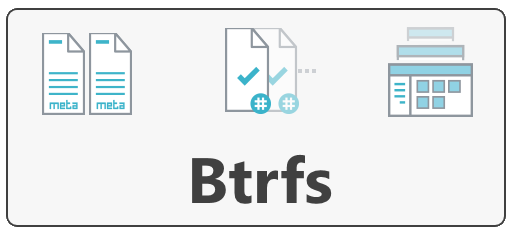

  
  

# BTRFS Configuration with Arch Linux

[BTRFS](https://docs.kernel.org/filesystems/btrfs.html#:~:text=Btrfs%20is%20a%20copy%20on,open%20for%20contribution%20from%20anyone.) has more advanced features, such as snapshots, data integrity checks, and built-in RAID support. Ext4 focuses on providing a reliable and stable file system with good performance. Ext4 performs better in everyday tasks and is faster for small file writes. _BTRFS_ excels when working with large files and large volumes, but its Copy-on-Write functionality can sometimes cause slowdowns in small file writes.

## Formatting

- For the EFI partition: `mkfs.fat -F32 /dev/sda1`
- Make the swap: `mkswap /dev/sda2`
  - Activate: `swapon /dev/sda2`
- Format the main partition: `mkfs.btrfs /dev/sda3`

## Mounting

- Mount the root partition: `mount /dev/sda3 /mnt`
- Create sub-volumes:
  - Create for root: `btrfs su cr /mnt/@`
  - Create for Home: `btrfs su cr /mnt/@home`
  - Create for Snapshots: `btrfs su cr /mnt/@snapshots`
  - Create for Logs: `btrfs su cr /mnt/@var_log`

> Next step requires an unmounting and re-mounting

- To unmount: `umount /mnt`
- To re-mount the root: `mount -o noatime,compress=lzo,space_cache=v2,subvol=@ /dev/sda3 /mnt`
  - Make directories for the sub-volumes: `mkdir -p /mnt/{boot,home,.snapshots,var_log}`
  - Re-mount the home: `mount -o noatime,compress=lzo,space_cache=v2,subvol=@home /dev/sda3 /mnt/home`
  - Re-mount the snapshots: `mount -o noatime,compress=lzo,space_cache=v2,subvol=@snapshots /dev/sda3 /mnt/.snapshots`
  - Re-mount the var_log: `mount -o noatime,compress=lzo,space_cache=v2,subvol=@var_log /dev/sda3 /mnt/var_log`
- Mount the EFI Partition: `mount /dev/sda1 /mnt/boot`

> Continue to the installation mentioned in [Arch Linux Installation Manual](https://github.com/khaledCSE/selfMade-Tutorials/blob/main/install-arch.md)
