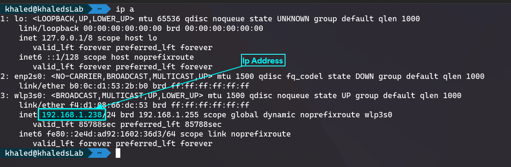

# Installing Arch Linux (Base)

## Setting up Prerequisites
1. `setfont ter-224b.psf.gz` For better looking and bigger terminal text.
2. `ping -c 3 archlinux.org` To check internet connection.

3. `ls /sys/firmware/efi/efivars/` to check if efi loaded. If no error, then OK.

4. `timedatectl set-ntp true`

### If `Wi-fi` is needed
Wi-fi can be connected using `iwctl` utility tool. To connect to a wi-fi network:

* Type `iwctl` and hit `ENTER`
* To get wi-fi network adapter, type `device list` and hit `ENTER`
* To scan for networks:
  * Type `station device scan` and hit `ENTER`
  * Type `station device get-networks` and hit `ENTER`
* To connect, type `station device connect <SSID>` and hit `ENTER`
  * Enter password and hit `ENTER`
  * For more info, refer to the [ArchWiki](https://wiki.archlinux.org/title/Iwd#iwctl)

### For Remote Installation using `ssh`
In *Remote(Target)* machine:
* Setup root password:
  * Type `passwd` and hit `ENTER`
  * Set root password
* Get `ip address` by typing `ip a` and hit `Enter`

  

On *Local(Host)* machine:
* Open Terminal and type `ssh root@<IP_ADDRESS>` and hit `ENTER`
  * Enter the root password for the `target` machine.
  * Start from `Pre-requisites

## Automatically update mirror list with fastest mirrors
* Run `reflector --sort rate -c <COUNTRY_NAME_1> -c <COUNTRY_NAME_2> --verbose --save /etc/pacman.d/mirrorlist`
  * Example: `reflector --sort rate -c Bangladesh -c 'United Kingdom' --verbose --save /etc/pacman.d/mirrorlist`
* Run `pacman -Syy` to refresh the repositories.

## Partitioning
1. `cfdisk` Then select `gpt`
2. Minimum 200 mb for `EFI` and rest is for `OS`
3. Write changes and quit.
4. `mkfs.ext4 /dev/sda2`
5. `mkfs.fat -F32 /dev/sda1`

## Mounting Drives
1. `mount /dev/sda2 /mnt`
2. `mkdir /mnt/efi`
3. `mount /dev/sda1 /mnt/efi`

## Install linux base and firmware
1. `pacstrap /mnt base linux linux-firmware`

## Generate Filesystem
1. `genfstab -U /mnt >> /mnt/etc/fstab`

## Change to root
1. `arch-chroot /mnt`

## Switch to a local mirror
1. `pacman -Sy nano`
2. `nano /etc/pacman.d/mirrorlist`
3. Add a local mirror at the top.
4. Bangladesh mirror is [Xeonbd Mirror](http://mirror.xeonbd.com/archlinux/$repo/os/$arch)
5. Add at the top of the mirrorlist: `Server = http://mirror.xeonbd.com/archlinux/$repo/os/$arch` 

## Date-time and locale
1. `ln -sf /usr/share/zoneinfo/Asia/Dhaka /etc/localtime`
2. `hwclock --systohc`
3. `nano /etc/locale.gen`
4. Run `locale-gen`
5. Uncomment `en_US.UTF-8` and save

## Configuring host
1. `nano /etc/hostname` then add a hostname and save
2. `nano /etc/hosts` and add the following to the file and save:
 ```
127.0.0.1   localhost
::1         localhost
127.0.1.1   <HOST_NAME>.localdomain  <HOST_NAME>
```

## Setting up user and root
1. `passwd`
2. `useradd -G wheel -m <User>`
3. `pacman -Syy netctl`
4. `pacman -Syy dhcpcd`
5. `passwd <User>`
6. `pacman -Syy sudo`
7. `EDITOR=nano visudo`
8. Uncomment `%wheel ALL=ALL` then save and exit

## Configuring Network [IMPROVED! + Latest]
> Arch has a much easier way to configure network than `dhcpcd` mentioned in the *LAN* section below. `networkmanager` package does it easily. This handles the wi-fi and lan pretty smoothly and provides a GUI interface too.

To install it, run: `sudo pacman -Syy networkmanager`

## Bootloader installation
1. `pacman -Syu grub efibootmgr`
2. `grub-install --target=x86_64-efi --efi-directory=/efi/ --bootloader-id=Arch`
3. `grub-mkconfig -o /boot/grub/grub.cfg`
4. `exit`
5. `shutdown now`
6. Remove installation medium

### Enable NetworkManager
* Run `sudo systemctl enable NetworkManager`
* Run `sudo systemctl start NetworkManager`

> Note: No need to configure *(DHCPCD) LAN* if *NetworkManager* is installed and configured. 

## Configuring network (LAN)
1. `cd /etc/netctl`
2. `sudo cp examples/ethernet-dhcp .`
3. `sudo nano ethernet-dhcp` and uncomment `DHCPClient`
4. `ip a` and find the second adapter name. This case it is (enp0s3)
5. `sudo nano ethernet-dhcp` and replace `interface` value with step-4
6. `sudo systemctl enable dhcpcd`
7. `sudo systemctl start dhcpcd`

# Installing GUI
Two of my favorite Desktop environments are Cinnamon and Deepin
## Greeter and GUI
1. `pacman -Syu lightdm deepin deepin-extra xterm`

# References
1. [Arch Mirror List](https://archlinux.org/mirrorlist)
2. [Video Tutorial](https://www.youtube.com/watch?v=LaJ1yl6NckI)